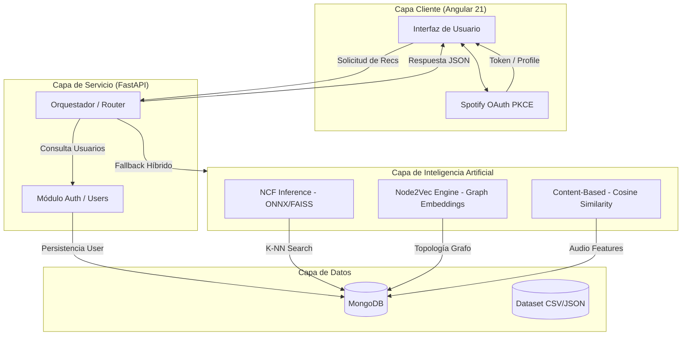

# Visión General y Arquitectura

SoundWave es un sistema de recomendación musical avanzado que integra técnicas de filtrado basado en contenido, grafos y aprendizaje profundo para ofrecer una experiencia personalizada según el estado emocional del usuario.

## Stack Tecnológico

El proyecto ha sido diseñado siguiendo una arquitectura de microservicios desacoplados y moderna:

- **Frontend:** [Angular 21](https://angular.io/) — Single Page Application (SPA) reactiva utilizando Signals para la gestión del estado y TypeScript 5.
- **Backend:** [FastAPI](https://fastapi.tiangolo.com/) — Framework de alto rendimiento en Python 3.13 que sirve como capa REST y orquestador de modelos.
- **Base de Datos:** [MongoDB](https://www.mongodb.com/) — Motor NoSQL para el almacenamiento de 1.2M de canciones, usuarios y perfiles de onboarding.
- **Entorno y Dependencias:** [uv](https://github.com/astral-sh/uv) — Gestor de paquetes ultrarrápido para Python.
- **IA/ML Stack:** PyTorch, Scikit-learn, FAISS, ONNX Runtime y Gensim.

---

## Arquitectura del Sistema

La arquitectura sigue un flujo de datos bidireccional donde el cliente solicita recomendaciones contextuales y el servidor selecciona el motor de inferencia más adecuado según la disponibilidad de datos.

## Organización del Repositorio

- `src/api/`: Definición de la API REST y seguridad.
- `src/modeling/`: Implementación de los tres motores de recomendación y scripts de exportación.
- `src/data/`: Pipeline de ingeniería de datos e ingesta masiva.
- `src/evaluation/`: Protocolos de evaluación científica y métricas.
- `frontend/`: Aplicación cliente en Angular.
- `docs/`: Documentación técnica (esta wiki).
